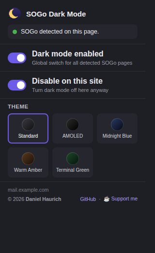

# SOGo Dark Mode

[](LICENSE)


A small browser extension that automatically switches **SOGo webmail**
into dark mode — no matter which domain your SOGo server runs on. No URL
needs to be configured: the extension detects SOGo by looking for
typical markers in the page (a meta tag, `SOGo.woa` resource paths, its
AngularJS app signature) and only activates itself there.

**By [Daniel Haurich](https://github.com/Daniel-Haurich).**
Like the extension? [☕ Support me on Buy Me a Coffee](https://www.buymeacoffee.com/danielhaurich).



## Features

- **Automatic detection** – no domain configuration needed, works on any
  self-hosted SOGo server.
- **5 themes** – Standard, AMOLED (true black), Midnight Blue, Warm
  Amber, Terminal Green. Switch with one click in the popup.
- **Manual per-domain override** – in case auto-detection doesn't work on
  a particular installation.
- **No data collection** – everything runs locally; settings are stored
  only in `chrome.storage.local` on your machine.

## Themes

| Theme | Description |
|---|---|
| **Standard** | Neutral dark gray/black |
| **AMOLED** | True black, a bit more contrast |
| **Midnight Blue** | Cool blue cast |
| **Warm Amber** | Warm brown/amber tone |
| **Terminal Green** | Greenish retro-terminal look |

Technically, every theme is based on the same CSS filter trick
(`invert(1) hue-rotate(θ)`), just with a different hue angle θ.
Images/videos/attachments automatically get the mathematically exact
counter-filter, so they show up in their real colors instead of being
inverted themselves.

## Installation

### From the store (recommended, once published)
- Microsoft Edge Add-ons: *link coming after publication*
- Chrome Web Store: *link coming after publication*

### Manual (developer mode)

```bash
git clone https://github.com/Daniel-Haurich/sogo-dark-mode.git
```

**Microsoft Edge**
1. Open `edge://extensions`.
2. Enable **"Developer mode"** in the top left.
3. Click **"Load unpacked"** → select the cloned folder.

**Google Chrome**
1. Open `chrome://extensions`.
2. Enable **"Developer mode"** in the top right.
3. Click **"Load unpacked"** → select the folder.

## Repository structure

```
sogo-dark-mode/
├── manifest.json           Manifest V3
├── content/
│   ├── detect.js           SOGo detection + theme application
│   └── darkmode.css        Filter CSS for all 5 themes
├── popup/
│   ├── popup.html
│   ├── popup.css
│   └── popup.js
├── icons/                  16/32/48/128 px
├── docs/
│   └── popup-screenshot.png
└── .github/
    ├── workflows/package.yml   builds a store ZIP on every "v*" tag
    └── ISSUE_TEMPLATE/
```

## Building a release / store ZIP

Push a tag like `v1.2.0` and the GitHub Action automatically builds
`sogo-dark-mode-<version>.zip` and attaches it to the release:

```bash
git tag v1.1.0
git push origin v1.1.0
```

Or do it manually:

```bash
zip -r sogo-dark-mode.zip manifest.json content popup icons
```

## Usage

- Clicking the extension icon opens a popup:
  - **Dark mode enabled** – global on/off switch.
  - **Status indicator** – shows whether SOGo was detected on the
    current page.
  - **Force on/disable on this site** – in case auto-detection doesn't
    trigger on a particular installation, dark mode can be forced on or
    switched off manually per domain.
  - **Theme picker** – 5 color variants, see above.

## How it works

The extension applies a CSS filter (`invert(1) hue-rotate(θ)`) to the
entire document once SOGo is detected. Images, videos, and attachments
get the exact counter-filter so they look normal. This is the same
underlying mechanism many "force dark mode" extensions use, and it works
reliably even on complex AngularJS UIs like SOGo, without having to
rebuild every single SOGo CSS class.

## Security note

This extension does **not** read your emails, passwords, or any other
content — it only inspects the HTML structure (meta tags, script paths)
to detect SOGo, and only changes the visual appearance via CSS. No data
is sent to any external server.

## Contributing

Issues and pull requests are welcome! There's a template for bug reports
under `.github/ISSUE_TEMPLATE/`.

## License

[MIT](LICENSE) © 2026 Daniel Haurich
